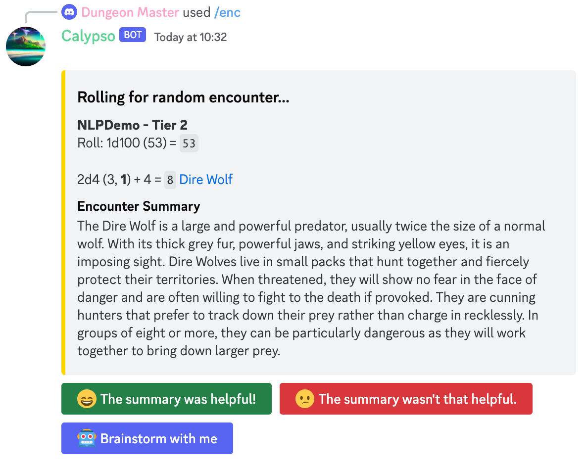

# CALYPSO: LLMs as Dungeon Masters’ Assistants

This repository contains the main CALYPSO system from the paper [*CALYPSO: LLMs as Dungeon Masters’
Assistants*](https://arxiv.org/abs/2308.07540). CALYPSO takes the form of a Discord bot that DMs can use to understand
D&D monsters and brainstorm encounter ideas.

This version available in this repository is a slightly modified version in order to make CALYPSO easier to run.
Compared to the full version (available at https://github.com/northern-lights-province/calypso), this version:

- Uses SQLite instead of PostgreSQL
- Requires DMs to input encounters, rather than rolling on predefined random tables
- Includes all SRD (available under Creative Commons) D&D monsters
- Does not include weather and other game-specific tools for the Northern Lights Province server

## Requirements

Calypso requires Python 3.10+.

To install Calypso's dependencies, run `pip install -r requirements.txt`.

## Setup

- Create a new Discord bot: https://discord.com/developers/applications
- Set up environment variables:
    - `TOKEN`: The Discord bot token from the step above
    - `OPENAI_API_KEY`: Your OpenAI API key
- Invite the newly created bot to your own Discord server

## Usage

To run Calypso, run `python main.py`.

### Biomes

In order to use the encounter assistance features, you must first set up *biomes*. Biomes describe the area an encounter
takes place in, which helps add interesting narrative to the encounter.

To set up a biome, use the `/encadmin biome setup` command in your Discord server. You'll first provide the biome
name, then a modal will pop up for you to provide the biome description.

For example, a biome might look like:

> **Woodlands**  
> In the woodlands, towering trees reach up above a bed of fallen leaves and dense greenery. Nature-inclined characters
> might be able to recognize the distinct presence of redwoods and sequoias, hundreds of feet tall and dozens of feet
> across at their base, but a smattering of foreign species dot the landscape as well. With such dense foliage above,
> only a filtered dim light makes it down to the surface.

### Encounter

To use Calypso with an encounter, run the `/enc` command. You'll be asked to provide the encounter text (e.g. "{1d4}
Kobold") and the biome the encounter takes place in (from the list defined in the previous step). Calypso will then
roll any dice in the encounter (dice expressions should be surrounded with curly braces) and identify the monsters in
the text.

Next, Calypso will show you the encounter again with links to the monsters highlighted and options to use the
brainstorming interfaces detailed in the paper.

### Open-Domain Conversation

To use the open-domain conversation baseline, use `/ai chat`.

## Logging

By default, all encounters and encounter brainstorms are saved to the SQLite database in `data/calypso.db`.

The table layout is defined in `calypso/models.py`.
